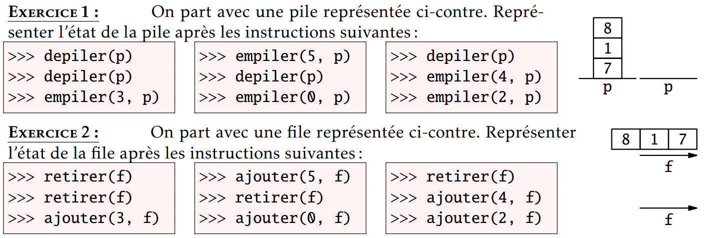
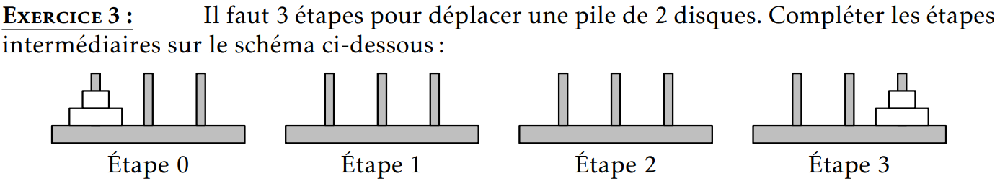
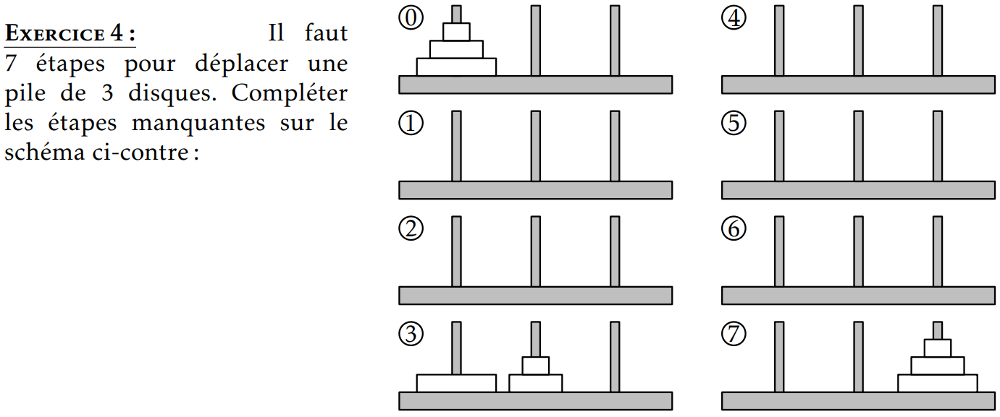
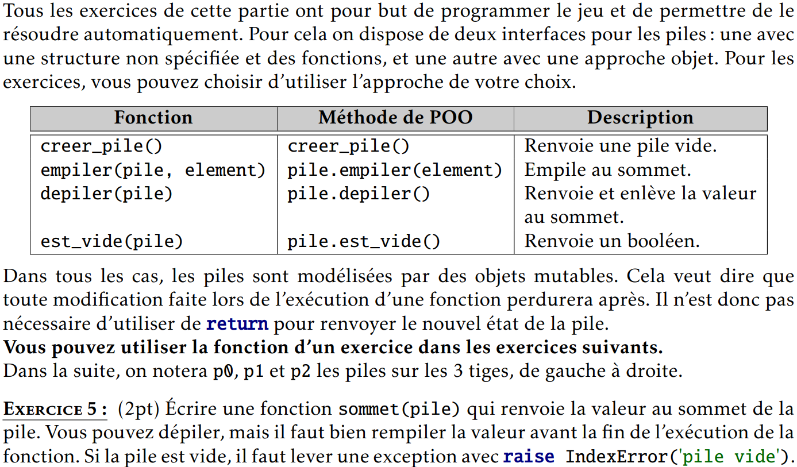
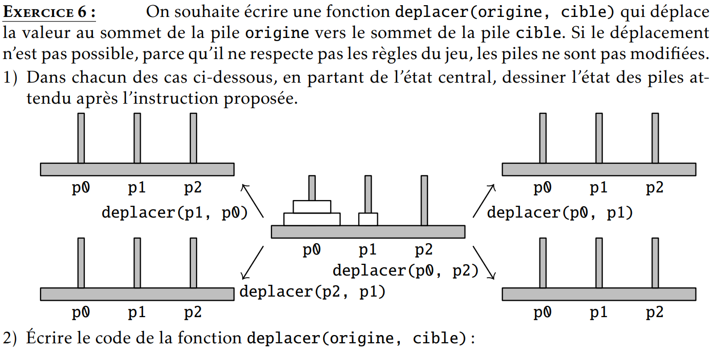
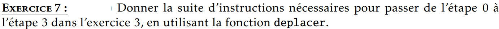
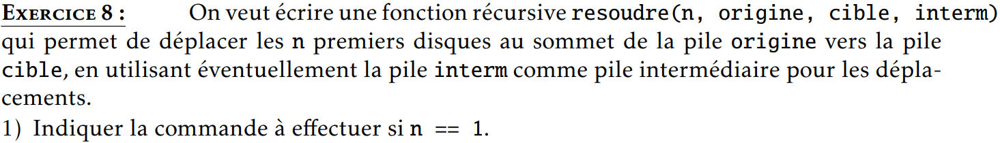
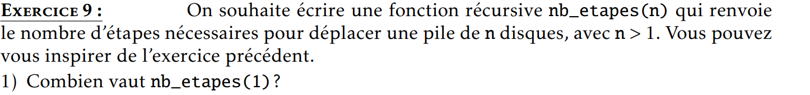
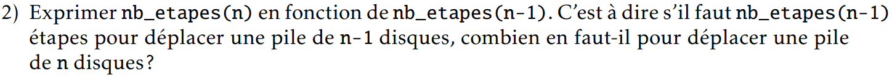
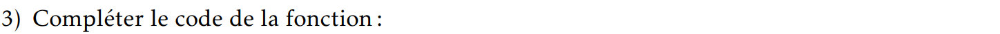

# Les tours de Hanoï

<!-- #### Rappels Pile/File -->

<!-- #### Schémas de principe -->



<div style="page-break-after: always;"></div>

## Programmation en Python



```python
def sommet(pile) :


```
<div style="page-break-after: always;"></div>



```python
def deplacer(origine, cible) :


```


```python


```


```python

```


```python


```

```
nb_etapes(1) = ...
```

```
nb_etapes(n) = ...
```

```python
def nb_etapes(n) :


```
